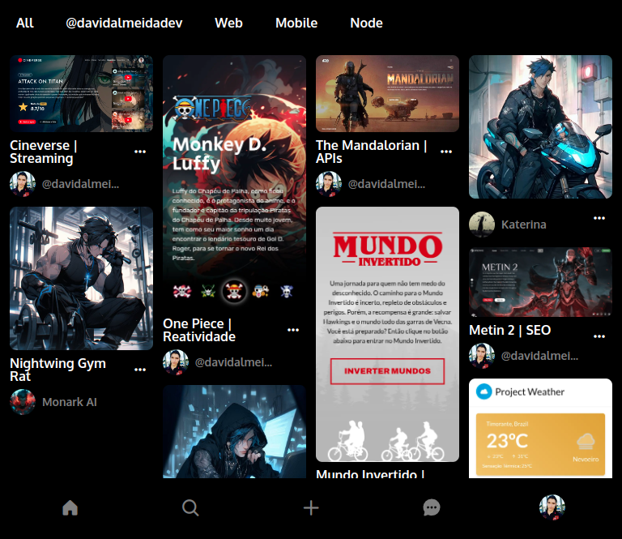

<h1 align="center">Rocketseat: Pinterest</h1>

  

This project is the clone of an already known application to work in practice with some initial concepts of HTML and CSS, it was a project worked on by Rocketseat to introduce fundamentals to newbies in programming where I wanted to insert a little JavaScript to manipulate the DOM tree and review how to dynamically insert elements using a programming language like JS.

  <a href="#-tecnologies">Technologies</a>&nbsp;&nbsp;&nbsp;|&nbsp;&nbsp;&nbsp;
  <a href="#-project">Project</a>&nbsp;&nbsp;&nbsp;|&nbsp;&nbsp;&nbsp;
  <a href="#-layout">Layout</a>&nbsp;&nbsp;&nbsp;|&nbsp;&nbsp;&nbsp;
  <a href="#-license">License</a>

## 🔗 Links

## 🚀 Tecnologies

This project was developed with the following technologies:

- HTML5, CSS3, JS ES6+
- [Phosphor Icons](https://phosphoricons.com/)
- [Ionic Icons](https://ionic.io/ionicons/usage)
- [Font Awesome Icons](https://fontawesome.com/)

## 💻 Project

In this simple project to create a simple and intuitive interface like Pinterest I used slightly advanced concepts such as Mobile First, I used CSS BEM conventions, in addition to HTML and CSS, and I also used JavaScript to dynamically add elements within of HTML by creating components, applying classes, effects and images.

Using the benefits of nomenclatures with CSS BEM, I was able to make the code more organized and semantic, easier to maintain and with Mobile First I created a simple structure to scale the application, making it also accessible between other devices such as cell phones, tablets and computers.

## 🏡 Get started

To start this project in your code editor, if it is VS Code, you must have the Live Server extension installed. But you can visit it in production [here](https://rocketseat-project-pinterest.vercel.app/).

## 🔖 Layout

You can view the project layout by clicking [here](https://br.pinterest.com/).

  

## 📝 License

This project is under the [MIT license](./LICENSE).
